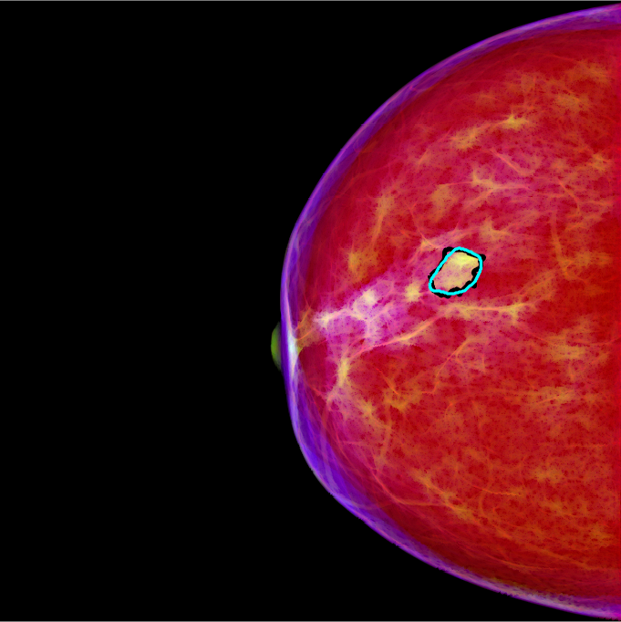

# Fully automatic computer-aided mass detection and segmentation via pseudo-color mammograms and Mask R-CNN


Algorithm for simultaneous detection and segmentation of mammographic masses via pseudo-color mammograms and Mask R-CNN.
```
Hang Min, Devin Wilson, Yinhuang Huang, Samuel Kelly, Stuart Crozier, Andrew P Bradley, Shekhar S. Chandra
```

* Preprint available on Arxiv.org: http://arxiv.org/abs/1906.12118
* Code: [GitHub Repository – 
https://github.com/Holliemin9090/Mammographic-mass-CAD-via-pseudo-color-mammogram-and-Mask-R-CNN]
* Mask R-CNN code: [GitHub Repository – 
https://github.com/matterport/Mask_RCNN]

* Data: [INBreast dataset]( https://www.sciencedirect.com/science/article/pii/S107663321100451X)
* Trained model example: [GitHub Pages - 
https://github.com/Holliemin9090/Mammographic-mass-CAD-via-pseudo-color-mammogram-and-Mask-R-CNN/releases/tag/v1]

## In a nutshell
The proposed method transforms conventional grayscale mammograms into pseudo-color mammograms using multi-scale morphological sifting (MMS). The MMS can enhance lesion-like patterns within a specified size range. Two scales are used in MMS and two output images are generated. These two images are then appended to the grayscale mammogram to form a RGB pseudo-color image. The lesion-like patterns will show color contrast to the background in the new pseudo-color image as shown in the image above (the blackline represents the annotation and the cyan line represents the segmentation generated by the proposed method).

The pseudo-color mammograms are then used as inputs for the Mask R-CNN. The Mask R-CNN is trained to perform simultaneous detection and segmentation of breast masses. We notice that using pseudo-color mammograms improved the detection and segmentation performance of Mask R-CNN when compared with using conventional grayscale mammograms.


## How to use the code:

The method consists of 3 steps: pre-processing, pseudo-color image generation and Mask R-CNN detection/segmentation.

### Pre-processing

This step is to normalize the raw mammograms and pad them into a square shape.

The main script is “Preprocess_mammo_mask.py”. The normalization function is in module “Preprocess_mammo.py” and the padding function is in “utility.py”.


### Pseudo-color image generation

This step is to generate two output images by applying a 2-scale morphological sifting (MS) on the mammograms. The grayscale mammogram is put in the R (red) channel, the output from the smaller scale MS is put in the G (green) channel and the output from the larger scale is put in the B (blue) channel.

* Details on multi-scale morphological sifting (MMS): [Multi-scale sifting for mammographic mass detection and segmentation](https://iopscience.iop.org/article/10.1088/2057-1976/aafc07)

The main script is "Pseudo_color_image_generation.m".

Function "Morphological_filter_bank.m" is to generated the magnitudes of the linear structuring elements.
Function "Morphological_sifter.m" is to perform MMS on the input image. 

### Applying Mask R-CNN

We use transfer learning with Mask R-CNN due to the size limitation of the dataset used. The pre-trained model "mask_rcnn_balloon.h5" needs to be downloaded.

Pre-trained weights : [mask_rcnn_balloon.h5](https://github.com/matterport/Mask_RCNN/releases)

The [Mask_RCNN code](https://github.com/matterport/Mask_RCNN) needs to be downloaded and put in the "Mask_r_cnn" folder.

The main script for training and testing is "mamo_CAD.py". The configuration for Mask R-CNN has been specified in this file. We used 5-fold cross validation in our paper, and one of the trained models is uploaded as an example under the name of "[mask_rcnn_mamogram_weights.h5](https://github.com/Holliemin9090/Mammographic-mass-CAD-via-pseudo-color-mammogram-and-Mask-R-CNN/releases/tag/v1)".
		
* For training, run:

```
python mamo_CAD.py train --weights=mask_rcnn_balloon.h5
```

* For testing, run:

```
python mamo_CAD.py segment --weights=logs/mask_rcnn_mamogram_weights.h5 --image=scans/pseudo_color_image/


```
### Visualize the detection/segmentation results

The main script is "overlay_detection_segmentation_results.m" which calculates the true positive rate (TPR), the false positive rate (FPR) and the Dice similarity index (DSI) of the segmentation.


## Dependencies

The proposed method is implemented in MATLAB R2018a and Python 3.6.


